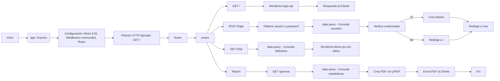
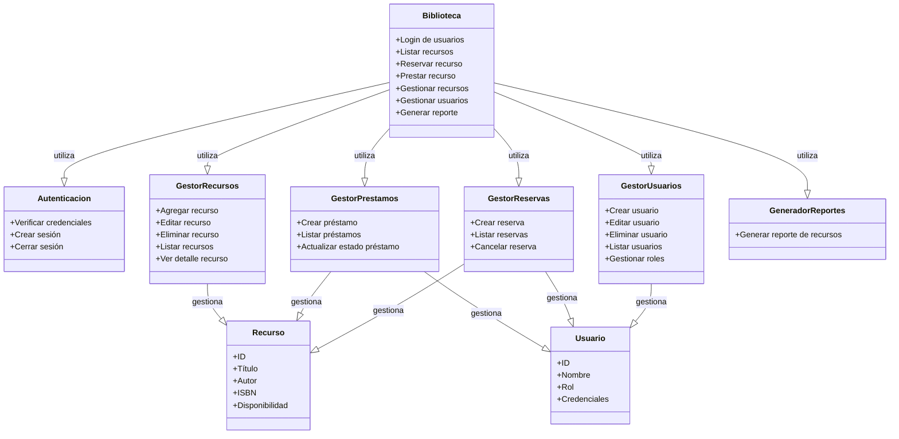

# Proyecto biblioteca

**Diagrama de flujo**

```mermaid
graph LR
A[Inicio] --> B(app- Express);
B --> C[Configuración: Motor EJS, Middleware urlencoded, Rutas];
C --> D[Petición HTTP Ejemplo: GET /];
D --> E[Ruteo];
E --> F[routes];
F --> G[GET /];
G --> H[Renderiza login.ejs];
H --> I[Respuesta al Cliente];
F --> J[POST /login];
J --> K[Obtiene usuario y password];
K --> L[data.query - Consulta usuarios];
L --> M[Verifica credenciales];
M -- Sí --> N[Crea Sesión];
M -- No --> O[Redirige a /];
N --> P[Redirige a /nav];
O --> P;
F --> Q[GET /lista];
Q --> R[data.query - Consulta biblioteca];
R --> S[Renderiza libros.ejs con datos];
F --> U[Report];
U --> V[GET /generar];
V --> W[data.query - Consulta estadísticas];
W --> X[Crea PDF con jsPDF];
X --> Y[Envia PDF al Cliente];
Y --> Z[Fin];
```

**Diagrama UML**

```mermaid
classDiagram
    class Biblioteca {
        +Login de usuarios
        +Listar recursos
        +Reservar recurso
        +Prestar recurso
        +Gestionar recursos
        +Gestionar usuarios
        +Generar reporte
    }
    class Autenticacion {
        +Verificar credenciales
        +Crear sesión
        +Cerrar sesión
    }
    class GestorRecursos {
        +Agregar recurso
        +Editar recurso
        +Eliminar recurso
        +Listar recursos
        +Ver detalle recurso
    }
    class GestorPrestamos {
        +Crear préstamo
        +Listar préstamos
        +Actualizar estado préstamo
    }
    class GestorReservas {
        +Crear reserva
        +Listar reservas
        +Cancelar reserva
    }
    class GestorUsuarios {
        +Crear usuario
        +Editar usuario
        +Eliminar usuario
        +Listar usuarios
        +Gestionar roles
    }
    class GeneradorReportes {
        +Generar reporte de recursos
    }
    class Recurso {
        +ID
        +Título
        +Autor
        +ISBN
        +Disponibilidad
    }
    class Usuario {
        +ID
        +Nombre
        +Rol
        +Credenciales
    }

    Biblioteca --|> Autenticacion : utiliza
    Biblioteca --|> GestorRecursos : utiliza
    Biblioteca --|> GestorPrestamos : utiliza
    Biblioteca --|> GestorReservas : utiliza
    Biblioteca --|> GestorUsuarios : utiliza
    Biblioteca --|> GeneradorReportes : utiliza

    GestorRecursos --|> Recurso : gestiona
    GestorPrestamos --|> Recurso : gestiona
    GestorPrestamos --|> Usuario : gestiona
    GestorReservas --|> Recurso : gestiona
    GestorReservas --|> Usuario : gestiona
    GestorUsuarios --|> Usuario : gestiona

```
